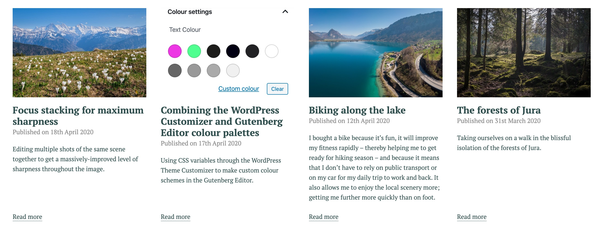

# Gutenberg Block: Blog Cards

Add a server-side-rendered list of the newest 4 posts. Sticky posts
are explicitly excluded but this can easily be modified.

## Preview

## Usage

- Add the _block.jsx_ file to the normal structure in the Theme.
- Add the _blog-cards.scss_ file to the normal structure in the Theme.
- Add the _BlogCards.php_ file to the src structure in the Theme.
- Use the _partials/blocks/blog-cards.php_ file for the output.

## Requirements

* WordPress 5.4

## Author

mark@sayhello.ch March 2020
