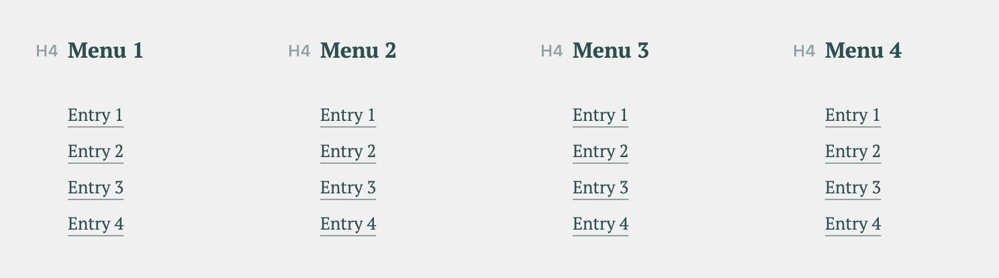

# Gutenberg Block: Footer with four menus

Adds a custom four-column Block containing [InnerBlocks](https://github.com/WordPress/gutenberg/tree/master/packages/block-editor/src/components/inner-blocks).

The Block `sht/footer-with-four-menus` contains a fixed HTML structure formed of 
`core/heading` and `sht/footer-with-four-menus-menu` inner blocks. This code also 
registers the `sht/footer-with-four-menus-menu` block, which cannot be inserted 
directly from the editor.

## Preview

## Usage

- Add the _block.jsx_ file to the normal structure in the Theme.

## Requirements

* WordPress 5.4

## Author

mark@sayhello.ch March 2020
