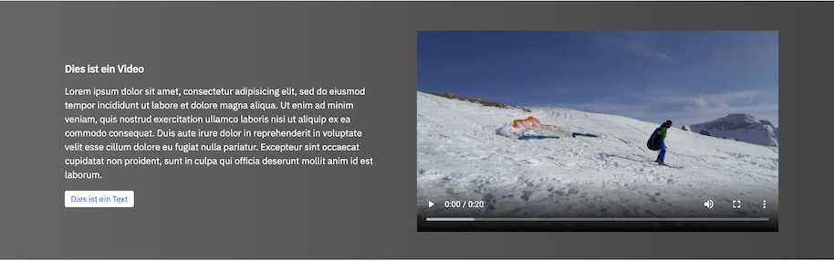

# Gutenberg Block: Video with text

Adds a two-column Block containing attributes for a video (from the media library), a title, and [InnerBlocks](https://github.com/WordPress/gutenberg/tree/master/packages/block-editor/src/components/inner-blocks) for paragraphs and a button.

This block may be obsolete, as it can easily be achieved by a grouped set of core blocks.

## Preview

## Usage

- Add the _block.jsx_ file to the normal structure in the Theme.

## Requirements

* WordPress 5.4

## Author

mark@sayhello.ch 2019
