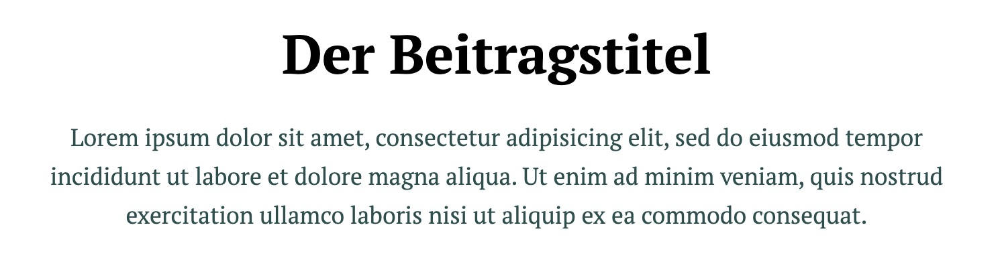

# Gutenberg Block: Post Header

Add a server-side-rendered view of the Post or Page title
and excerpt (if the excerpt is defined). The block displays 
the regular Post meta information and has no specific content 
adjustments, except for text alignment.

## Preview

## Usage

- Add the _block.jsx_ and _edit.jsx_ files to the normal structure in the Theme.
- Add the _PostHeader.php_ file to the src structure in the Theme.
- Use the _partials/blocks/post-header.php_ file for the output.

## Add Excerpt support to Pages

    add_action('init', function() {
        add_post_type_support( 'page', 'excerpt' );
    });

## Special use of withSelect

The content of the Block is rendered on the server via PHP. In the 
`view` context, it uses the regular `get_the_title()` and `get_the_excerpt()` 
functions.

Because the Block sometimes needs to show the **unsaved** title and excerpt 
in the editor, we create block attributes for `post_title` and `post_excerpt` 
and pass the current state of these attributes to the `<ServerSideRender />` 
component. This component passes these attributes to the server and the 
server-side rendering uses these values.

The values of these attributes are saved with the block, but are only 
used in rendering the block in the `edit` context. The `view` context always 
uses the values saved in the database as `$post->post_title` and `$post->post_excerpt`.

## Requirements

* WordPress 5.4

## Author

mark@sayhello.ch April 2020
