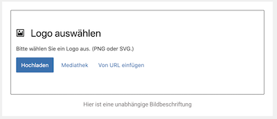
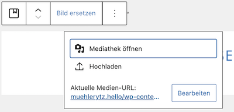

# Image selector for Say Hello components

Based on UI from the `core/image` Block in WordPress 5.5+. Places an inline 
uploader tool in the Block content area with buttons for Media Library, Upload 
and Insert from URL. If an image is selected, the inline uploader is hidden and 
editing takes place via a `Button` in the `Toolbar`.

## Preview

### MediaPlaceholder



### MediaReplaceFlow



## Author

* mark@sayhello.ch
* Thanks to https://samhermes.com/posts/implementing-media-controls-in-custom-blocks/

## Attributes

This version uses the lazyImage logic in the Say Hello “Hello Roots” Theme 
and can be used if the image is being rendered directly in the editor.

### Image

The `image` attribute must be an Object, not a Number. If the Block is to be rendered 
server-side, use the basic [ImageSelector](https://github.com/SayHelloGmbH/Gutenberg/tree/master/components/imageselector) 
Component instead, which passes the attribute as a simple ID to the server. (Passing a 
complete image object to server-side rendering will exceed the maximum number of 
GET parameters.)

### External URL

If you're using the external image URL functionality, then you will need a 
source attribute (standard is `externalURL`) to hold the URL as a string. This 
option has to be explicitly activated by passing `allowURL={true}`.

### Standard attributes

```jsx
attributes: {
	image: {
		type: 'Object',
		default: {
			id: false
		}
	},
	externalURL: {
		source: "attribute",
		selector: "img.wp-block-sht-certificate__imagefromurl",
		attribute: "src"
	},
},
```

## WordPress components

* [MediaPlaceholder](https://github.com/WordPress/gutenberg/blob/master/packages/block-editor/src/components/media-placeholder/README.md)
* [MediaReplaceFlow](https://github.com/WordPress/gutenberg/tree/master/packages/block-editor/src/components/media-replace-flow/README.md)

## Component properties

### accept
An comma-separated string of file MIME types which the upload dialog 
will accept. Standard value: `'image/*'`

### allowedTypes
An array of file MIME types which the image selector component will 
accept. Standard value: `'image'`

### allowURL
Whether or not to allow an external URL to be used as a source for the image. 
Standard value: `false`

### attributes
The attributes object from the Block. (**Required**.)

### imageAttribute
The Block attribute key to which the selected image object will be saved. 
Standard value: `'image'`

### externalURLAttribute
The Block attribute key to which the selected external URL will be saved. 
Standard value: `'externalURL'`

### imageFormat
The image format to be passed to the LazyImage endpoint.
Standard value: `'full'`

### labels
The labels object to be passed to the `MediaPlaceholder` component. ([Details](https://github.com/WordPress/gutenberg/tree/master/packages/block-editor/src/components/media-placeholder#labels).)
Standard value: `{}`

### setAttributes
The `setAttributes` function from the Block properties. (**Required**.)

## Usage example
```jsx
import ImageSelectorWithPlaceholder from '../../_components/ImageSelectorWithPlaceholder.jsx';

<ImageSelectorWithPlaceholder
	attributes={attributes}
	setAttributes={setAttributes}
	allowedTypes={['image/png','image/svg+xml']}
	accept={'image/png,image/svg+xml'}
	allowURL={true}
	labels={{
		title: _x('Logo auswählen', 'MediaPlaceholder title', 'sha'),
		instructions: _x('Bitte wählen Sie ein Logo aus. (PNG oder SVG.)', 'MediaPlaceholder instructions', 'sha')
	}}
/>
```
